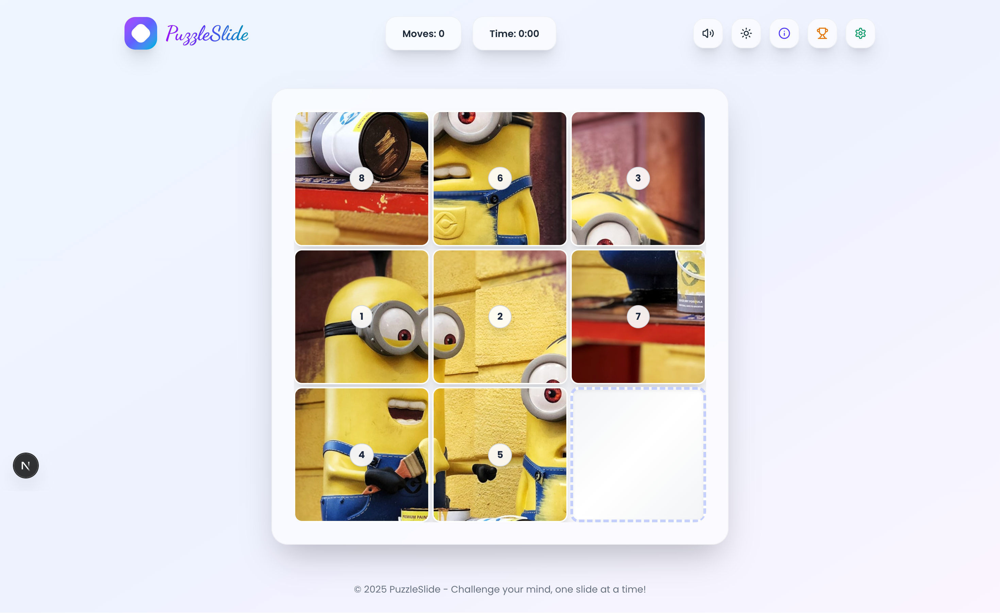
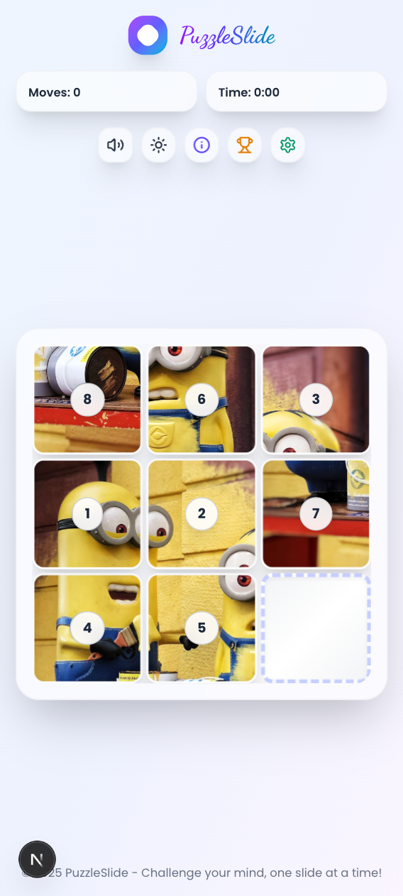
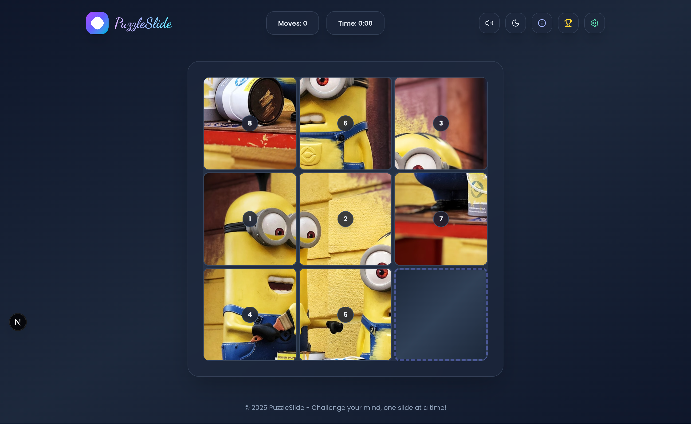

# 🧩 PuzzleSlide

<div align="center">

**A Modern, Interactive Sliding Puzzle Game Built with Next.js**

_Challenge your mind, one slide at a time!_

[](https://nextjs.org/)
[](https://www.typescriptlang.org/)
[](https://tailwindcss.com/)
[](https://www.framer.com/motion/)

[🎮 Play Demo](https://puzzleslide.vercel.app/) • [📖 Documentation](#features) • [🐛 Report Bug](#contributing) • [✨ Request Feature](#contributing)

</div>

---

## 🌟 Features

### 🎯 **Core Gameplay**

- **Interactive Sliding Puzzle** - Click tiles adjacent to empty space to solve the puzzle
- **Multiple Grid Sizes** - Choose from 3×3, 4×4, or 5×5 grid configurations
- **Beautiful Image Collection** - 8 stunning high-quality images to puzzle with
- **Smart Shuffle Algorithm** - Ensures every puzzle is solvable

### 🎨 **Modern UI/UX**

- **Glassmorphism Design** - Beautiful backdrop blur effects and gradient overlays
- **Smooth Animations** - Powered by Framer Motion for buttery smooth interactions
- **Responsive Design** - Perfect experience on desktop, tablet, and mobile devices
- **Dark/Light Mode** - Toggle between themes with persistent preferences

### 🔊 **Immersive Audio**

- **Slide Sound Effects** - Satisfying audio feedback when moving tiles
- **Victory Celebration** - Special sound when completing puzzles
- **Button Click Sounds** - Audio feedback for all UI interactions
- **Mute/Unmute Control** - Toggle sounds on/off with persistent settings

### 📊 **Progress Tracking**

- **Move Counter** - Track your efficiency with move counting
- **Timer** - Race against time to solve puzzles faster
- **High Score System** - Local storage of your best performances
- **Achievement Tracking** - Monitor progress across different grid sizes

### ⚡ **Technical Excellence**

- **TypeScript** - Full type safety and excellent developer experience
- **Performance Optimized** - React.memo, efficient renders, and optimized animations
- **PWA Ready** - Installable web app with offline capabilities
- **Modern Architecture** - Clean, maintainable code structure

---

## 🖼️ Screenshots

<div align="center">

### 🖥️ Desktop Experience



### 📱 Mobile Experience



### 🌙 Dark Mode



</div>

---

## 🚀 Quick Start

### Prerequisites

- **Node.js** 23.0 or higher
- **npm** or **yarn** package manager

### Installation

1. **Clone the repository**

   ```bash
   git clone https://github.com/atulguptag/puzzleslide.git
   cd puzzleslide
   ```

2. **Install dependencies**

   ```bash
   npm install
   # or
   yarn install
   ```

3. **Run the development server**

   ```bash
   npm run dev
   # or
   yarn dev
   ```

4. **Open your browser**
   Navigate to [http://localhost:3000](http://localhost:3000)

### Build for Production

```bash
npm run build
npm start
```

---

## 🎮 How to Play

1. **🎯 Objective**: Arrange numbered tiles in sequential order (1, 2, 3, etc.)
2. **🖱️ Movement**: Click tiles adjacent to the empty space to slide them
3. **⏱️ Challenge**: Complete the puzzle in minimum moves and time
4. **🏆 Score**: Your best performances are automatically saved locally
5. **⚙️ Customize**: Change grid size and images in the settings panel

### Pro Tips 💡

- Start by positioning corner and edge pieces first
- Work systematically row by row or column by column
- The puzzle is always solvable - never give up!
- Try different grid sizes to increase the challenge

---

## 🛠️ Tech Stack

| Technology        | Purpose         | Version |
| ----------------- | --------------- | ------- |
| **Next.js**       | React Framework | 15+     |
| **TypeScript**    | Type Safety     | 5.0+    |
| **Tailwind CSS**  | Styling         | 3.0+    |
| **Framer Motion** | Animations      | 10.0+   |
| **Lucide React**  | Icons           | Latest  |
| **Google Fonts**  | Typography      | Latest  |

---

## 📁 Project Structure

```
puzzleslide/
├── 📁 README.md
├── 🧩 package.json
├── ⚙️ next.config.js
├── 📂 src/
│   └── 🎮 app/
│       ├── 🎯 page.tsx          # Main game file
│       ├── 🏗️ layout.tsx        # Root layout
│       └── 💅 globals.css       # Global styles
```

---

## 🤝 Contributing

We welcome contributions! Here's how you can help:

### 🐛 Bug Reports

- Use the [GitHub Issues](https://github.com/atulguptag/puzzleslide/issues) page
- Include detailed reproduction steps
- Add screenshots if applicable

### ✨ Feature Requests

- Check existing issues first
- Describe the feature and its benefits
- Consider implementation complexity

### 🔧 Pull Requests

1. Fork the repository
2. Create a feature branch (`git checkout -b feature/amazing-feature`)
3. Commit changes (`git commit -m 'Add amazing feature'`)
4. Push to branch (`git push origin feature/amazing-feature`)
5. Open a Pull Request

---

## 📜 License

This project is licensed under the **MIT License** - see the [LICENSE](LICENSE) file for details.

```
MIT License

Copyright (c) 2025 PuzzleSlide

Permission is hereby granted, free of charge, to any person obtaining a copy
of this software and associated documentation files (the "Software"), to deal
in the Software without restriction...
```

---

## 👨‍💻 Authors

- **Atul Gupta** - _Initial work_ - [@atulguptag](https://github.com/atulguptag)

See also the list of [contributors](https://github.com/atulguptag/puzzleslide/contributors) who participated in this project.

---

## 🙏 Acknowledgments

- **Unsplash** - Beautiful high-quality images
- **Lucide** - Clean and consistent icons
- **Framer Motion** - Smooth animation library
- **Tailwind CSS** - Utility-first CSS framework
- **Next.js Team** - Amazing React framework

---

## 📞 Support

Having trouble? We're here to help!

- 🐛 **Bug Reports**: [GitHub Issues](https://github.com/atulguptag/puzzleslide/issues)

---

<div align="center">

**⭐ Star this repository if you found it helpful!**

_Made with ❤️ and lots of ☕_

**[⬆ Back to Top](#-puzzleslide)**

</div>
